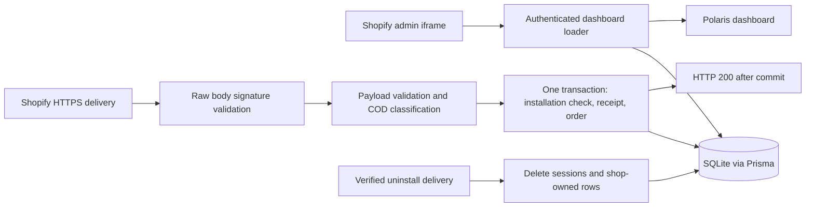

# Architecture

## Stack decision

**Recommended default: one Shopify React Router application with its existing Node backend.** This is a proposal, not an implemented system. The user has been offered a separate NestJS/TypeORM alternative; a different choice should update this document before application code is written.

| Concern | Selection | Reason and trade-off |
| --- | --- | --- |
| Runtime | Node 22, satisfying the generated template's engine constraints | Node 22.22.1 is installed; a broad "Node 20+" statement is less precise than actual package requirements |
| React application | Official Shopify React Router TypeScript template with Vite | Reuses embedded authentication, App Bridge, routing, and development tooling |
| UI | Polaris web components and the template's Polaris types | Meets the assignment and follows the currently inspected template; do not mix old Polaris React examples into it without checking compatibility |
| Backend | React Router server loaders/actions | Webhook endpoints and dashboard reads fit one process and one authentication boundary |
| Webhook verification | Official `@shopify/shopify-api` webhook validator, using the template's compatible adapter | Validates raw bytes without loading or refreshing offline access tokens; keep template authentication for admin routes |
| Persistence | Template Prisma client and SQLite | Built-in session storage and migrations; appropriate for one local demo process, not distributed production writes |
| Input contracts | Zod schemas, inferred TypeScript types | Validate untrusted runtime values without a separate decorator framework |
| Money conversion | decimal.js plus integer minor units | Exact conversion from decimal strings; database sums stay integer based |
| State | Loader data, `useRevalidator`, local React state when needed | No separate server-data cache or global mutable store to keep synchronized |
| Quality | Existing compatible ESLint ecosystem, typed rules, Prettier, strict TypeScript | Extend the scaffold rather than spending the budget migrating linter major versions |
| Tests | Vitest | Familiar Vite/TypeScript integration, focused pure and database-backed tests |

**Tailwind CSS:** defer for the first page. Polaris supplies layout, spacing, and styling. If a demonstrated layout gap justifies Tailwind later, use the official Vite integration, omit its global preflight reset, and avoid overriding Polaris internals.

**MobX:** defer. A read-only server snapshot plus a refresh action does not need an observable domain store. Reconsider for shared editable state, complex filters, or cross-page workflows. Do not duplicate loader data into MobX just to include a preferred package.

**NestJS + TypeORM alternative:** if selected, retain React/Vite and Polaris, expose same-origin `/api/dashboard` and webhook routes through a Nest server, use the official Shopify API library for token exchange and webhook validation, and implement a TypeORM-backed Shopify session adapter. Separate `ShopifyModule`, `OrdersModule`, and `DashboardModule` only where their responsibilities differ. Use entities and migrations with `synchronize: false`, injectable services, validated environment configuration, and DTOs with `class-validator`/`class-transformer`. Use `ValidationPipe({ whitelist: true, transform: true })` for ordinary app DTOs, while treating webhook raw-body verification as a separate boundary before DTO validation. Never coerce money or Shopify IDs into floating-point numbers. Validate session tokens, including audience, signature, expiration, and destination, through the official library. Use `rawBody: true` with a verified adapter/body-parser setup for Nest webhooks. Custom authentication/session integration adds material work; reserve approximately 45 to 90 minutes and re-estimate the deadline rather than pretending it is free.

Do not build both architectures or install unused alternatives.

## Boundaries and flow



Browser code never receives the Shopify app secret, access tokens, session rows, or raw webhook payload. Only the database and server modules hold that information. Keep database, payload handling, and authentication modules in `.server.ts` files.

Validate required server environment variables at startup and fail clearly if the app secret or application URL is missing. Do not retain a template fallback that silently uses an empty secret. The Shopify API key is a public app identifier; the API secret and access tokens must never use a `VITE_` prefix or appear in client configuration. Keep a placeholder-only `.env.example` once the actual generated environment contract is known.

## Suggested module layout

Extend the generated template, preserving its root document, headers, authentication routes, session adapter, and App Bridge setup.

```text
app/
  shopify.server.ts                  existing Shopify configuration/authentication
  db.server.ts                       existing singleton Prisma client
  orders/                            COD rule, money, payload, ingest, shops, dashboard query
  webhooks/                          raw-body validation and structured log lines
  dashboard/                         embedded page pieces
  routes/                            React Router flat-route names and thin handlers
  ...                               generated auth/root files
prisma/
  schema.prisma
  migrations/                       committed migration files, no database files
tests/
  cod.test.ts
  webhook-fixtures.ts
  webhook-signature.test.ts
  order-ingest.test.ts
  order-lifecycle.test.ts
scripts/
  replay-webhook.ts                  local replay utility, only if needed for demo
```

Keep the initial dashboard in one route file. Extract a component when repetition or complexity justifies it, not preemptively. No generic repository layer, application-wide event bus, dependency injection container, or custom queue is needed for the default architecture.

## Data model

Keep the generated `Session` model compatible with Shopify's Prisma adapter. Add three small models:

| Model | Fields | Constraints and purpose |
| --- | --- | --- |
| `Shop` | `domain: String`, `installedAt: DateTime` | `domain` primary key; local installation registry, created only through authenticated installation/authentication lifecycle |
| `Order` | `shop: String`, `orderId: String`, `name: String`, `totalMinor: BigInt`, `currency: String`, `gateways: Json`, `createdAt: DateTime`, `receivedAt: DateTime`, `isCod: Boolean` | Compound primary key `(shop, orderId)`; foreign key to `Shop` with cascade deletion; index `(shop, createdAt, orderId)` |
| `WebhookReceipt` | `shop: String`, `webhookId: String`, `topic: String`, `processedAt: DateTime` | Compound primary key `(shop, webhookId)`; foreign key to `Shop` with cascade deletion |

Only committed receipts represent completed work. There is no `processing` state that can be left behind by a crashed request. Receipt data is retained for the installation lifetime in this demo and removed on uninstall. Production retention must preserve the intended replay horizon and retain natural order uniqueness independently.

The generated session table can contain multiple sessions per shop, so do not use a single session ID as the order owner. Session deletion is part of uninstall's explicit transaction because it is not tied to the new `Shop` foreign key.

Create the installation record in the template's supported authenticated lifecycle hook, with an idempotent upsert that preserves `installedAt` on ordinary reauthentication. Share this small registration function with the dashboard loader, which may call it only after `authenticate.admin(request)` succeeds. This also handles a dev store authenticated before the new hook was added. In the registration transaction, confirm the matching persisted offline session still exists before creating `Shop`; do not use an already-deleted session from memory. Verify the locked template's hook timing at scaffold time. Webhook routes never create installations, and a client-supplied `shop` value is never registration authority.

There is a meaningful distinction between an unknown shop and incomplete registration. If `Shop` is absent but its offline session exists, return 503 from order intake and emit a setup diagnostic so Shopify can retry after authenticated registration succeeds. Only when both installation and offline session are absent is the delivery treated as unknown/uninstalled and ignored. Creating a dev-store order before the initial authenticated setup has finished is outside the collection window; show readiness before calling setup complete. Failure of either lookup is an infrastructure failure, not evidence of an unknown shop.

**ID precision:** prefer the numeric suffix of validated `admin_graphql_api_id` (`gid://shopify/Order/...`) as the canonical order ID. If unavailable, accept a decimal string ID or a positive safe integer only. Reject unsafe numeric IDs rather than converting an already-rounded JavaScript number into a string. If both safely readable forms exist, require agreement.

**Money:** keep `total_price` as a string until decimal.js converts it to integer minor units using the validated currency's fraction digits. For example, `USD 12.34` becomes `1234`, JPY `100.00` becomes `100`, and KWD `1.234` becomes `1234`. Obtain currency metadata through supported runtime internationalization data, check supported currency codes, and test zero-, two-, and three-decimal currencies. Reject negative totals, non-finite values, exponent notation, nonzero excess fractional digits, and values outside signed 64-bit storage range. Trailing zero fractions are harmless. Never use `parseFloat(price) * 100`. A database sum overflow is an explicit error, never a wrapped or approximate amount.

`BigInt` does not serialize directly to JSON. Convert totals back to exact decimal strings in the loader response. Show currency code plus the exact amount, such as `USD 123.45`, without converting money through JavaScript `number` for display.

## Payload and transport validation

1. Accept POST only, and enforce a request-size ceiling at the server adapter before buffering. Start with 2 MiB for the demo, verify it against actual sample payloads, and document that larger orders are rejected. Do not rely solely on `Content-Length`; chunked input also needs a limit. Do not install a JSON body parser ahead of signature validation.
2. In a small shared server helper, read the bounded raw body exactly once and call the official `webhookApi.webhooks.validate({ rawBody, rawRequest: request })` using the compatible adapter already installed by the template. Configure this validator from the same validated app configuration. Add `@shopify/shopify-api` as an explicit direct dependency matching the template's resolved compatible version; do not rely on accidental transitive access. Do not invent a `shopify.api` property on the React Router app object or import private SDK internals.
3. Verify the installed SDK's call chain and tests. Only after successful signature/header validation, parse the original body inside a narrow `JSON.parse` error boundary and map malformed JSON to 400. The HMAC validator uses the app secret and base64 digest; its comparison checks equal-length buffers without an early exit on differing content. Do not claim it literally calls Node's `crypto.timingSafeEqual` when the inspected implementation uses its own comparison routine. The helper returns a minimal validated context plus an `unknown` payload; it never loads, refreshes, or saves access tokens.
4. Require a delivery ID, well-formed canonical `*.myshopify.com` domain, expected webhook topic, and supported payload shape. Match the SDK's topic representation, which can be an enum-style name instead of the wire `orders/create` spelling.
5. Treat the returned payload as `unknown` at the application boundary. Parse only the order fields needed by the app; strip unrelated keys. Customer names, addresses, email, phone, and line-item details are not persisted.
6. Require valid order identity/name, money/currency, creation timestamp, a string array of gateway names, and a supported nullable financial status. An empty gateway array is valid and non-COD; a missing required gateway field is malformed, not silently replaced with fabricated data.
7. Normalize the timestamp to UTC and gateway strings only after validation. Retain displayable gateway names separately from the lowercased values used for classification.

HMAC covers the body, not arbitrary headers or a payload timestamp. Use HTTPS, Shopify's validated request context, fixed route/topic checks, the local installation registry, and scoped data access together. Do not describe a valid HMAC as independently signing the shop header. Do not reject legitimate delayed deliveries using a newly invented timestamp-signature scheme.

The inspected `authenticate.webhook()` source validates the body, then can refresh and persist an expiring offline session before returning the parsed payload. That behavior is unnecessary for this app's webhook routes and can fail after an uninstall revokes the token. It can also race with cleanup by writing a refreshed session after deletion. Therefore the selected webhook path uses the SDK's lower-level validator from the outset, with local installation checks in the domain transaction. This retains official signature handling without depending on a live Admin API token. Template `authenticate.admin()` remains responsible for embedded admin authentication.

Explain both paths in the walkthrough: the template helper is convenient when a webhook needs an Admin API client, while this app needs only signature validation and local persistence. Test the exact lower-level validator used in production rather than a separate hand-written HMAC verifier.

## Transaction and idempotency

For a valid normalized `orders/create` event:

```text
authenticate raw request and validate selected payload fields
start one bounded database transaction
  check Shop for the validated shop
    absent with offline session: return retryable setup failure
    absent without offline session: ignore as unknown/uninstalled
  insert WebhookReceipt(shop, webhookId, topic)
  upsert Order by (shop, orderId)
    create: normalized fields
    update: no changes for orders/create
commit
return 200
```

If the receipt already exists, roll back this attempt and return 200. Handle only the receipt's unique-conflict case as a duplicate; do not convert every Prisma error into success. Confirm the same receipt key exists if the database's error metadata does not identify the constraint reliably. Business-key uniqueness also prevents two different delivery IDs for the same order from producing two rows.

The installation check and writes share the transaction. SQLite's single-writer behavior, foreign keys, and bounded transaction wait/work govern races. An order that commits before uninstall is removed by uninstall. An order arriving after uninstall cannot recreate `Shop`; it is ignored. Unresolved lock or write conflicts return a retryable failure for Shopify to redeliver, rather than looping inside the request or acknowledging lost work.

No counters are incremented separately. Dashboard metrics derive from stored orders, so an interrupted request cannot leave counts detached from the records.

| Outcome | HTTP response | Persistence behavior |
| --- | --- | --- |
| New valid order, transaction committed | 200 | Receipt and order present |
| Previously committed delivery | 200 | No additional order |
| Same order with a new delivery ID | 200 | New receipt, existing order unchanged |
| Valid delivery for an unknown/uninstalled shop | 200 | No shop, order, or receipt created; sanitized ignored-event log |
| Missing installation record but existing offline session | 503 | No receipt/order writes; retry after authenticated registration |
| Invalid signature | 401 | No application writes |
| Missing authentication headers | 400 from wrapper's validation-result mapping | No application writes |
| Signed malformed JSON or invalid required fields | 400 | No application writes; sanitized validation reason |
| Wrong topic for route | 400 | No writes |
| Non-POST | 405 | No writes |
| Oversized request | 413 | No writes |
| Database unavailable, busy beyond bound, or unexpected error | 500/503 | Transaction rolled back, allowing Shopify retry |

Shopify can retry permanent 4xx failures too; they are not a magic retry-suppression mechanism. Log them distinctly for diagnosis. Never convert an infrastructure failure to 200 just to make the delivery dashboard green.

## Uninstall lifecycle

Validate the raw uninstall request using the same session-independent SDK validator and require the uninstall topic. In one transaction, delete every `Session` for the shop and delete its `Shop` record; cascade deletion removes all orders and receipts. Do this even when no session exists, or a stored token has expired or been revoked. An already-missing shop is successful cleanup. No permanent uninstall receipt is necessary: deletion itself is idempotent, and the requirement is to remove shop-owned data.

Do not contact the Admin API to authorize deletion after uninstall; the access token may already be revoked. Do not persist an uninstall payload. Test rollback if any cleanup statement fails.

This prevents normal post-uninstall order deliveries from recreating data, including session refreshes originating from webhook handlers. A delayed uninstall from a previous installation arriving after a rapid reinstall, or an already-running admin authentication flow completing after uninstall, is a separate lifecycle-generation problem. The baseline does not claim to solve either using an unsigned timestamp header. Call them out and add a verified installation-generation strategy before production.

## Dashboard contract and UI

The `/app` dashboard loader authenticates the admin request independently of the parent layout. Child loaders must not assume the parent completed first. Derive shop ownership from the authenticated server session, never from a client-supplied shop or request body. Complete the authenticated registration check described above before querying metrics; setup failures get a recoverable error response.

Within a consistent database read transaction:

- Aggregate all orders for this shop by `(currency, isCod)`, returning count and sum of `totalMinor`.
- Read exactly 20 orders for this shop, sorted by `createdAt DESC, orderId DESC`.
- Derive overall order count and COD count from the grouped counts; calculate `0` percent for no orders and otherwise `100 * codCount / orderCount`, displayed to one decimal.

Conceptual response:

```ts
type DashboardData = {
  ordersReceived: number;
  codOrders: number;
  codSharePercent: number;
  totalsByCurrency: Array<{ currency: string; amount: string }>;
  latestOrders: Array<{
    id: string;
    name: string;
    createdAt: string;
    total: string;
    currency: string;
    gateways: string[];
    isCod: boolean;
  }>;
  refreshedAt: string;
};
```

Render four summary areas: orders received, COD orders, COD share, and total order value. In the final area display separate labeled currency amounts when needed; an empty store displays no received value without inventing a currency. Table columns: order name, date, total with currency, gateways, and explicit COD yes/no text. Empty gateways display "Not specified". Dates use the viewer's locale with the timezone disclosed. Use accessible Polaris table/layout components available in the installed version; verify their API rather than guessing component names.

Use an explicit Refresh button with pending feedback and last-refreshed time. A Shopify webhook does not automatically push data to the open browser. An empty state explains that the page starts collecting after installation and offers refresh. Provide a recoverable error state that does not expose stack traces. Avoid client polling, WebSockets, pagination, filtering, and charts in the baseline.

Send private no-store responses for merchant data. Preserve Shopify's generated response headers and embedded frame policy; a generic `X-Frame-Options: DENY` would break the app.

## Performance and production direction

Local targets are goals until measured: accepted/duplicate webhook acknowledgement p95 below 500 ms with a warm process, and dashboard loader p95 below 250 ms on roughly 1,000 fabricated orders. The five-second Shopify delivery limit is the external constraint. Start with a 500 ms transaction acquisition wait and a 1,000 ms transaction execution limit, adjusted only from measurements; do not add in-process retries in the baseline. Return a retryable failure on database contention. Budget separately for raw-body reading, validation, tunnel, and response overhead. Prisma transaction timeouts alone do not bound the entire request, and a `Promise.race` timeout does not cancel a database write.

The order list is indexed and bounded. Aggregation still scans the current shop's orders; that is acceptable for the demo and explicitly not constant-time at scale. Do not load every complete order into Node or add one database query per displayed row. Avoid caches for now because cross-shop keys and invalidation would add risk without demonstrated need.

For 10,000 merchants, merchant count alone is not a capacity target. As a discussion example only: 100 orders per merchant per day is one million events/day, approximately 12/sec average before duplicates and bursts. Measure the real distribution. Move to PostgreSQL, a durable intake queue or transactional inbox, idempotent workers, per-shop fairness, reconciliation, and lifecycle-aware retention. Acknowledge only after durable enqueue, monitor queue age and retry/dead-letter counts, and keep uninstall deletion coordinated with queued work. Use rollup tables only after aggregate-query measurements justify them.

## Primary references

Checked on 2026-09-22. These are reference versions, not the future application's lockfile.

- [Shopify scaffold guide](https://shopify.dev/docs/apps/build/scaffold-app)
- [Official React Router template and dependency constraints](https://github.com/Shopify/shopify-app-template-react-router/blob/main/package.json)
- [Template dashboard using Polaris web components](https://github.com/Shopify/shopify-app-template-react-router/blob/main/app/routes/app._index.tsx)
- [Webhook authentication API](https://shopify.dev/docs/api/shopify-app-react-router/latest/authenticate/webhook)
- [Authentication implementation](https://github.com/Shopify/shopify-app-js/blob/main/packages/apps/shopify-app-react-router/src/server/authenticate/webhooks/authenticate.ts)
- [Session-independent webhook validator](https://github.com/Shopify/shopify-app-js/blob/main/packages/apps/shopify-api/lib/webhooks/validate.ts) and [offline-token refresh behavior](https://github.com/Shopify/shopify-app-js/blob/main/packages/apps/shopify-app-react-router/src/server/helpers/ensure-offline-token-is-not-expired.ts)
- [HMAC validator](https://github.com/Shopify/shopify-app-js/blob/main/packages/apps/shopify-api/lib/utils/hmac-validator.ts) and [comparison implementation](https://github.com/Shopify/shopify-app-js/blob/main/packages/apps/shopify-api/lib/auth/oauth/safe-compare.ts)
- [Webhook delivery verification and timeouts](https://shopify.dev/docs/apps/build/webhooks/verify-deliveries)
- [Subscription setup and order-access prerequisites](https://shopify.dev/docs/apps/build/webhooks/get-started?deliveryMethod=https)
- [Development protected-data access](https://shopify.dev/docs/apps/launch/protected-customer-data)
